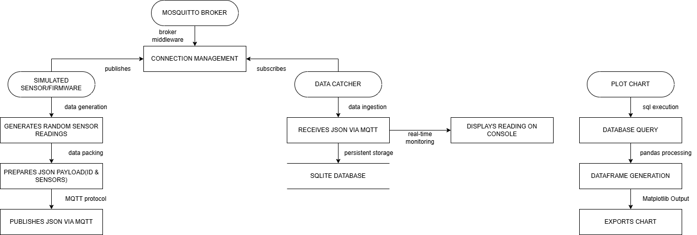
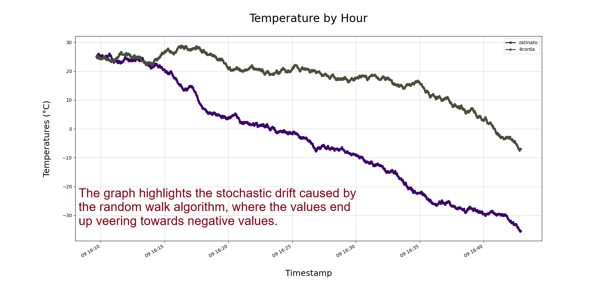
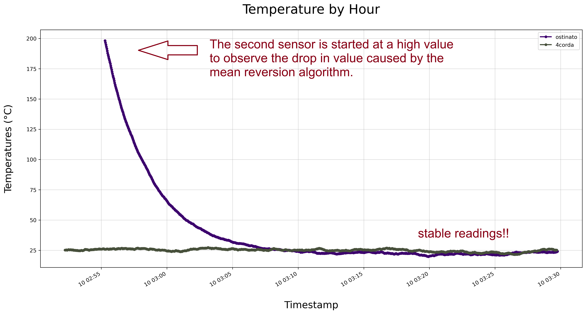

    <h1>IoT-Fullstack-Simulator: End-to-End Temperature Monitoring</h1>
    <b>This project is optimized for Linux; Windows support is not currently a priority.</b>

 

## 📚 About

This project started as a study on JSON payload handling via MQTT, but quickly evolved into a comprehensive **Full-Stack IoT Simulator**. To ensure a reliable end-to-end data flow, I developed a custom firmware to dashboard pipeline.

During development, I identified a **Stochastic Drift issue** in the initial temperature engine, where values would diverge unrealistically over time. To solve this, I implemented an adaptation of the **Ornstein-Uhlenbeck Process**, a mean-reverting stochastic differential equation. This ensures the simulated temperature remains within physically plausible bounds while maintaining **realistic, time-correlated fluctuations**.

## 🗃️ Project Structure

    

| Directory | Responsibility |
| :--- | :--- |
| **`src/`** | Core engine: Sensor engine, Data Catcher, and Plotting scripts. |
| **`assets/`** | Static documentation: Flowcharts and comparative performance charts. |
| **`data/`** | Persistence layer: Storage for the `sensor-data.db` (SQLite). |
| **`output/`** | User output: Target folder for the latest generated telemetry reports. |

## 📝 Roadmap and Status

- [x] **V1.0 - Core Engine**
    - [x] C++ firmware simulation with synthetic telemetry values generation.
    - [x] Implementation of the MQTT protocol for asynchronous communication.
    - [x] Python script for data capture and persistence in SQLite3.
    - [x] Data processing (Timezone Normalization) with Pandas.
    - [x] Static trend visualization with Matplotlib.

- [x] **V1.1 - Stochastic Drift Fixed**
    - [x] Refactor of the Random Walk model to a mean-reverting stochastic algorithm.

- [ ] **V1.2 - System Security & Data Validation (Soon)**
    - [ ] Update security by implementing environment variables (.env) for credential management.
    - [ ] Implement validation for MQTT payloads.
    - [ ] Ensure data schema integrity for SQLite storage.

## **V1.1 - Stochastic Drift Fixed!! 📉**

### Temperature Simulation: Random Wals vs. Ornstein-Uhlenbeck  

| 1. The Problem: Stochastic Drift | 2. The Solution: Mean-Reversion |
| :---: | :---: |
| 

 | 

 |
| *Random Walk model: Values diverge unrealistically towards -∞* | *OU Process: Even starting at 200°C, values revert to the 25°C mean.* |
 

The biggest challenge for this simulator was ensuring that the generated temperature was realistic.

Initially, the sensors utilized a simple **Random Walk model**. However, the values **diverged unrealistically**, dropping to $-30^\circ C$ within just a few minutes of simulation.

By implementing an adaptation of the **Ornstein-Uhlenbeck process**, the system achieved the necessary stability. During the validation phase, I forced a sensor to start at $200^\circ C$ to test the algorithm's recovery. As observed, the algorithm "pulls" the value drastically back toward the mean of $25^\circ C$, maintaining **stable and consistent readings thereafter**.

## ⚙️ Setup

### Prerequisites
- C++ Compiler;
- Python3;
- Paho MQTT C++ library;
- Mosquitto Broker;
- SQLite3;
- Pandas;
- Matplotlib;
- Nlohmann JSON;
- Recommended: This project is optimized for Linux-based environments.

### How to run

**1. Configure the Broker**
- To allow message exchange without authentication in a test environment, edit the configuration files:
`sudo nano /etc/mosquitto/mosquitto.conf`

- Add these lines to the end of the file:
`allow_anonymous true`
`listener 1883 0.0.0.0`

- Save and restart the service:
`sudo systemctl restart mosquitto`

**2. Start the Data Collector**
- Run the `data-catcher.py` script to start listening to MQTT topics and saving data to SQLite.

**3. Simulate a Sensor**
- Compile the program:
`g++ -Wall -std=c++17 src/sensor-engine.cpp -o sensor -lmosquitto`

- Then run with parameters:
`./sensor [SENSOR_ID] [INITIAL_TEMPERATURE]`

**4. Generate Graphs**
- The visualization module is triggered manually when you wish to analyze the history running the `chart-plot.py`

## 🛠️ Stack

| Category | Technology |
| :--- | :--- |
| **Languages** | C++(Firmware simulation) and Python |
| **Communication** | MQTT Protocol (Mosquitto) |
| **Database** | SQLite3 |
| **Data Processing** | Pandas (Timezone Normalization GMT-3 & Sensor Segmentation) |
| **Visualization** | Matplotlib |
| **Environment** | Debian (CLI only), TMUX, HTOP, FrameBuffer Imageviewer(FBI) |
